>Project By: Jacob Yenney and Karisma Kumar

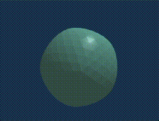

Subdividing a surface is the process of dividing a surfaces faces into several subfaces.  Different techniques of subdivision define these subfaces differently, however they often follow the same goal of smoothing out the overall surface.  This technique allows a very rough sketch of a geometry, to be smoothed out into a more detailed mesh.

# Download Build

[Windowsx64](Release/Windows-x64.zip)

# Mathematics

In this project we implemented two different methods of subdivision which we will examine below.

## Loop Subdivision

This method of subdivision was come up with by Charles Loop in 1987.  This method works only on triangle meshes and repated subdivision outputs a surface which is C2 continuous except for at boundary locations where it is C1 continuous.  

This was the first method we implemented, and is shown off in the demonstration gif, where a icosohedron is subdivided into an approximation of a sphere.

### The Algorithm

1. Split each edge, adding a new point in the middle.  The position of this point is determined as a weighted average of its neighbors: the two end points of the edge (weighted as 3/8), as well as the far point of the two faces connected to that edge (weighted as 1/8).  
    - Note for boundary points, the position is determined soley as the average of the two end points of the given edge (each end is weighted equally (1/2)).  

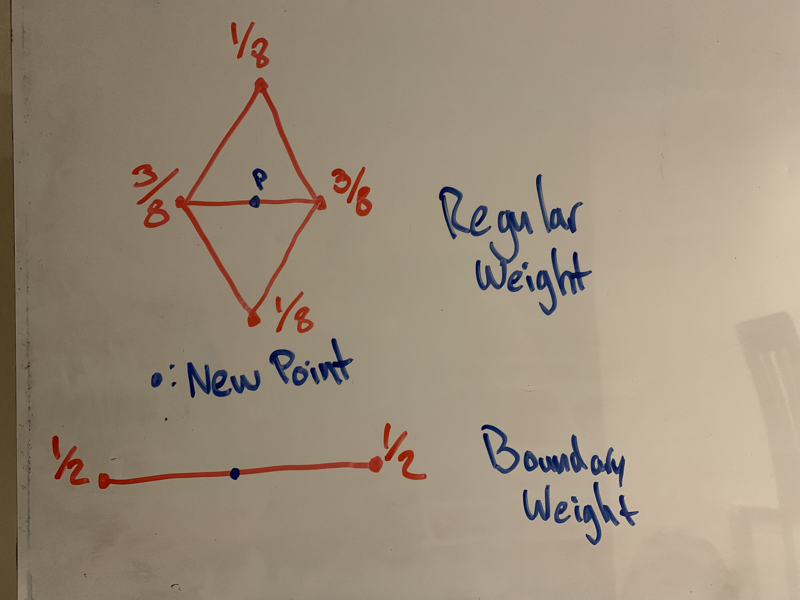

2. For each of the original vertices, approximate its position as a weighted average of all of its neighbors. Let n be the number neighbrs, and let B be the weight of each neighbor.  The original vertex's position will have weight 1 - n*B.  B can be calculated as follows:
    - n > 3 : B = 3 / (8 * n)
    - n = 3 : B = 3/16
- Note: For a given boundary point, P, the updated of P can be approximated using the counterclockwise most neighbor, U, and clockwise most neighbor, V, as (1/8) U + (1/8) V + (3/4) P.  

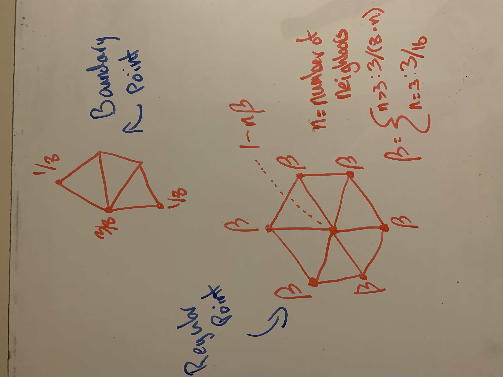

3. Finally we can use the newly created points as well as updated point positions to create new faces.  Each Triangle face will be split into 4 trianges.
   1. Take A to be a vertex of the given triangle.
   2. B, and C will then be the newly created edge points of the two connected edges of A on the face you are currently subdividing.
   3. Connect Edges A B C to create a new sub face.
   4. Repeat 1-3 for each vertex of the triangle.
   5. Finally create the internal face by connecting the 3 new points along the edges of the triangle.

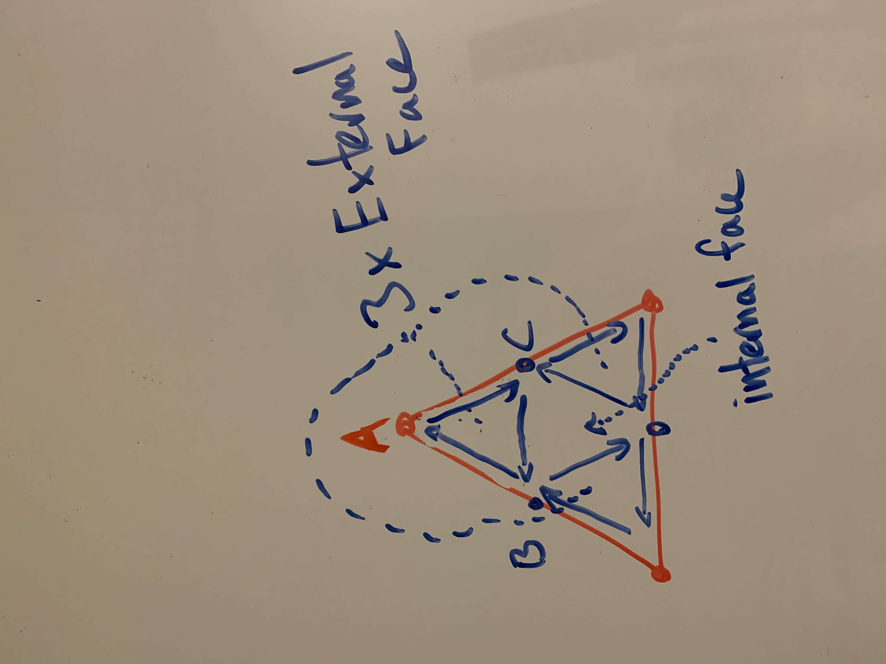

## Catmull-Clark Subdivision

This technique was developed by Edwin Catmull and Jim Clark in 1978.  The algorithm is different from Loop subdivision in that it can be used more genearlly on any polygonal mesh, however the output mesh will be composed entirely of quads.  Reapeated subdivision results in a C2 smooth mesh, (C1 at boundary points).  

### The Algorithm
Given the input Geometry G.

1. Create a new "face point", FP for each face of G.  The position of FP will be the average of each original vertex of the face.  
 
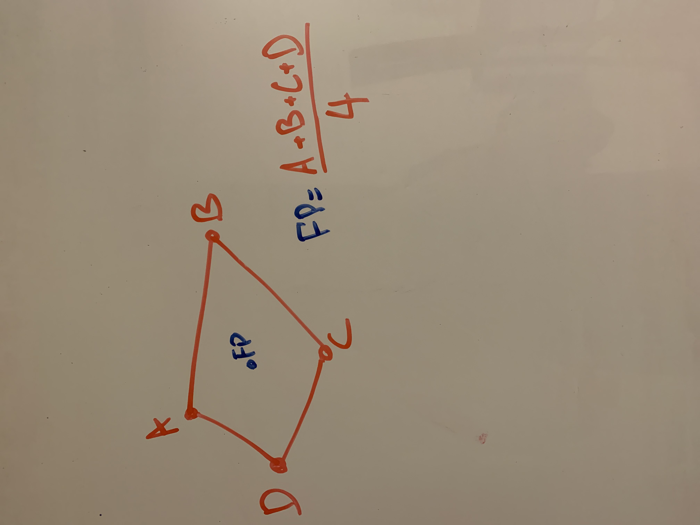

2. For each edge of G add a new edge point, EP.  The Position of EP will be equal to the average of the edges 2 neighboring face points, as well as the two end points of the edge EP is being added to.

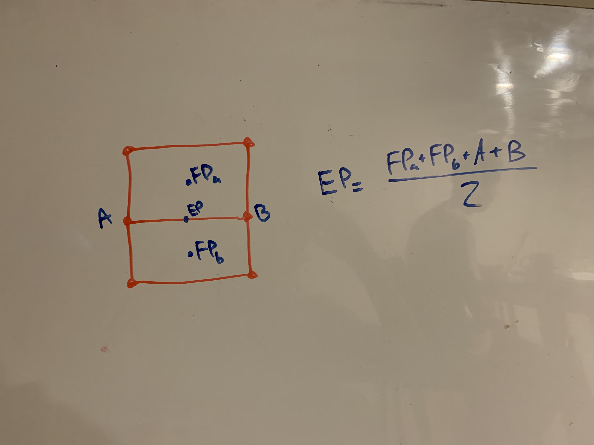

3. For each original vertex of G, update its position as an average of its new neighbors.  let P be the position of the original vertex.  let F be the average of the position of the face points of all n neighboring faces.  Let E be the average of the new edge points of the n neighboring edges.  Finally, the updated position of the vertex will be equal to (F + 2E + (n-3)P) / n. 

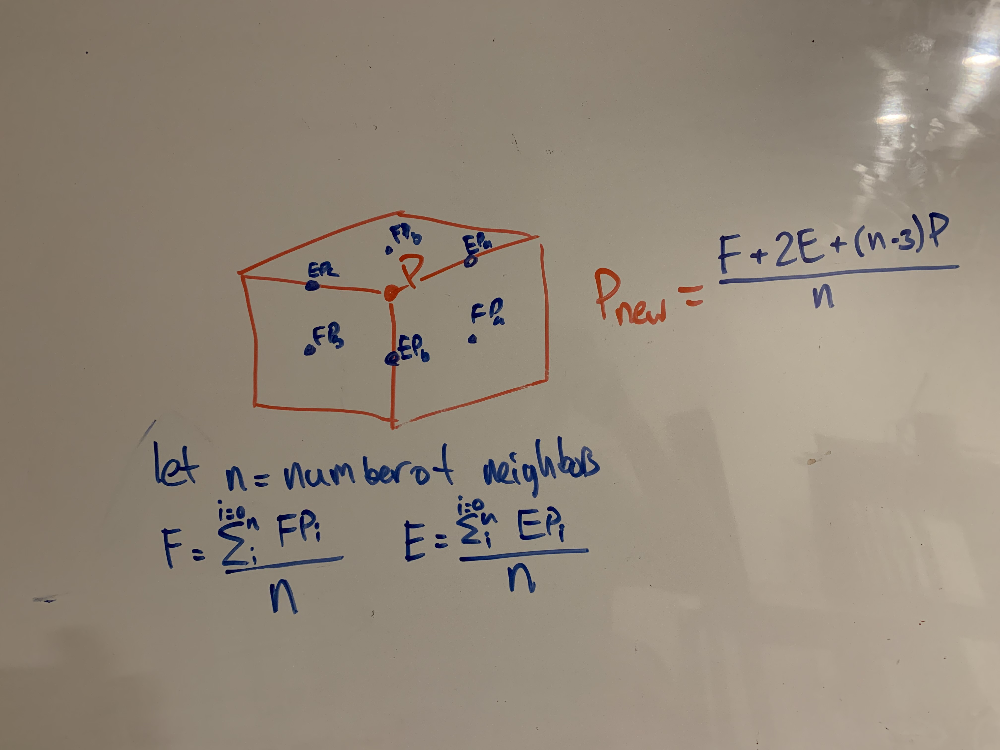

4. Finally connect the new points to create the new faces.
   1. Connect a new edge from each face point to the edge points of its face.  
    2. Connect an edge from each original vertex to the new edge points along its original edges.  
    3. Define the enclosed spaces as new faces.  These faces will always be composed of two edges from step 1 and two edges from step 2, generating a quad face.  

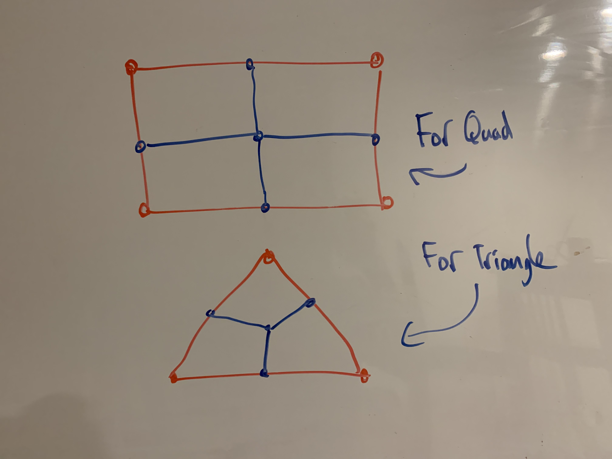

# Implemenation Details

We started with HW2 as a starting point for our code, adding two new files: HalfEdge.h and HalfEdge.cpp in which we implemented the HalfEdge data structure.  We also updated the shader code to support a basic form of lighting, and the main.cpp file to interface with the new data structure.

## HalfEdge Data Structure

In order to implement these subdivision algorithms, we implmented the helpful HalfEdge representation of a geometry.  This data structure splits a mesh into lists of the following structs: HalfEdges, Points, and Faces.  These
structs contain the following information

```c++
struct HalfEdge {
	HalfEdge* next;		//Pointer to next HalfEdge in triangle
	HalfEdge* flip;		//Pointer to HalfEdge on opposite side of edge.
	Point* src;			//Pointer to point this HalfEdge originates from. 
	Face* face;			//Pointer to triangle face this HalfEdge belongs to.
};

struct Point {
	HalfEdge* he;		//Pointer to an arbritrary HalfEdge originating from this point.
	glm::vec3 pos;		//Where this point is located in space, realtive to the models coordinates.
};

struct Face {
	HalfEdge* he;		//Pointer to an arbritary HalfEdge that is part of the face.  
};
```

We added some addition data to the structs which made certain parts of the subdivision algorithm and drawing the model easier.

``` c++
struct HalfEdge {
    ...
    bool isBoundary; // True if the halfedge is located on the edge of the mesh
}
struct Point {
    ...
    bool isBoundary; // True if the point is located on the edge of the mesh
}
struct Face {
    ...
    glm::vec3 norm; // Normal vector of the face
    bool newFace;   // True if the face was generated in the last iteration of Loop-Subdivision
}
```

In the program we first import a given .obj file to create a new HalfEdgeMesh object which contains the following vectors.  Currently only triangle or quad meshes are supported.

``` c++
std::vector<HalfEdge*> hes;
std::vector<Point*> pts;
std::vector<Face*> faces;
```

Next we define a function to convert the mesh into a form that can be sent to the GPU for rendering

``` c++
HalfEdgeMesh::BuildVAO();
```

Finally we define functions for subdivision

``` c++
HalfEdgeMesh::LoopSubdivde();
HalfEdgeMesh::CatmullSubdivide();
```
These function will update the he, faces, and pts, vectors of the object with its subdivided form.  In order to render the subdivided form, BuildVAO() must be called again.  

If LoopSubdivide is called with a quad mesh, the mesh will first have its quads split into two trianlgles and then the subdivision will take place.

# Examples

## Subdiving an Icosahedron:


### Using Loop Subdivision:

>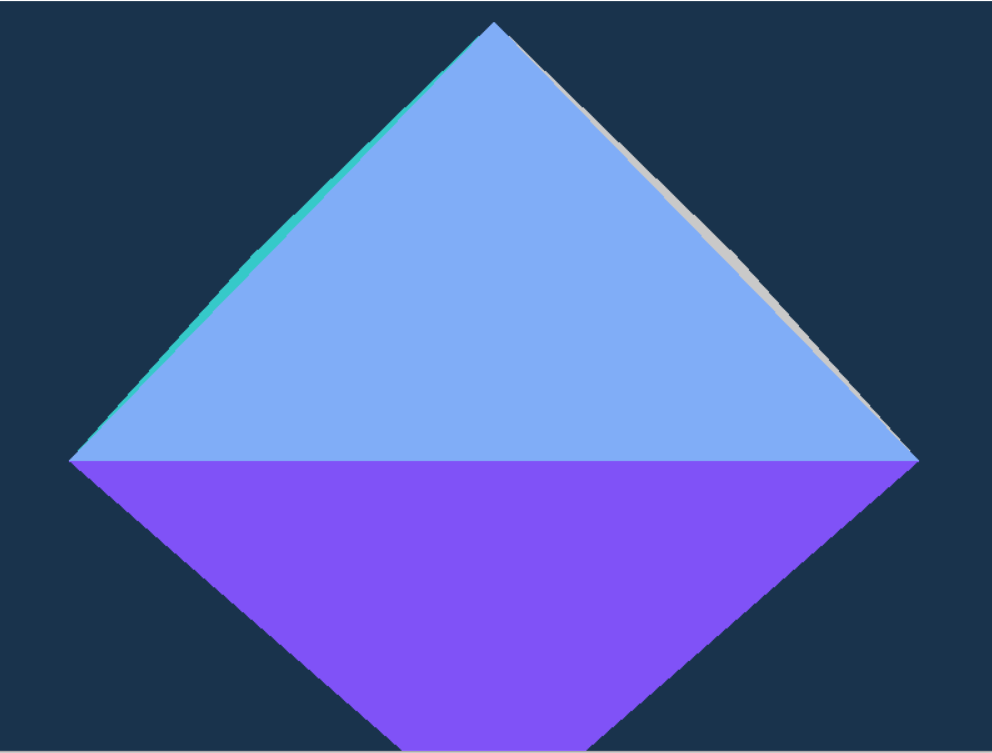  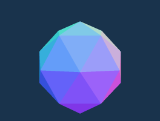  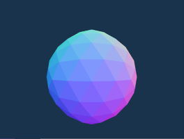

### Using Catmull-Clark:

>  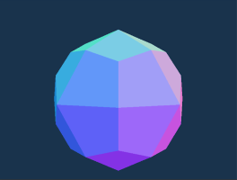  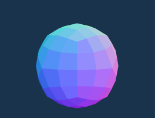


## Subdiving an Octahedron:


### Using Loop Subdivision

>  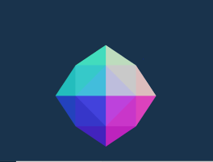  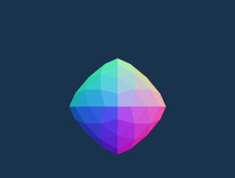

### Using Catmull-Clark

>  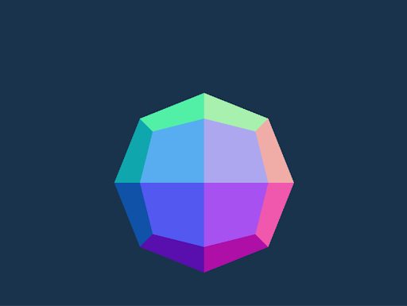 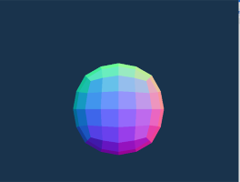

## Donut Catmull-Clark

>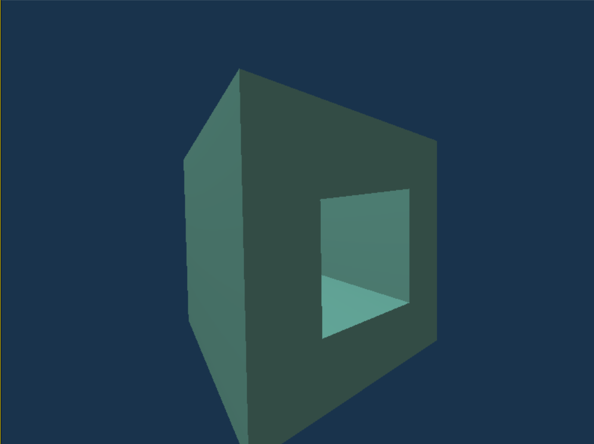  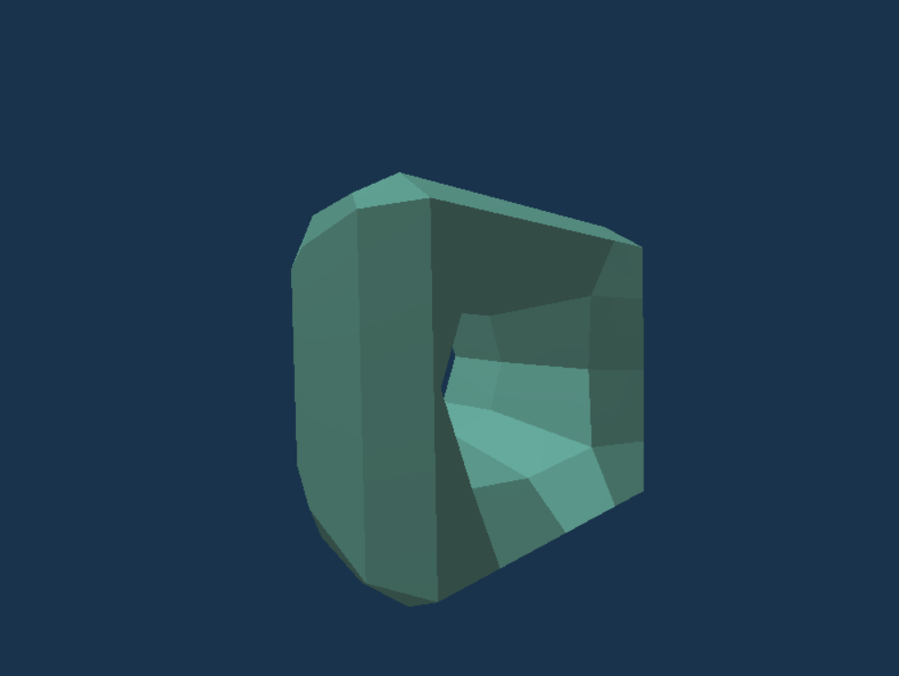  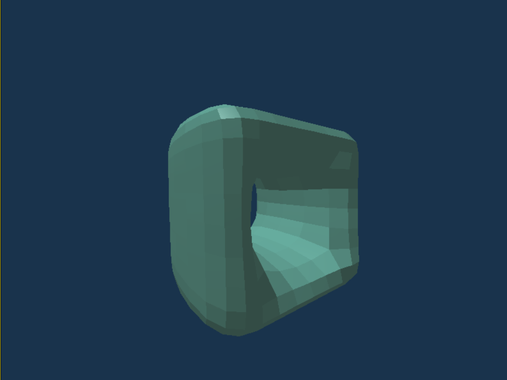  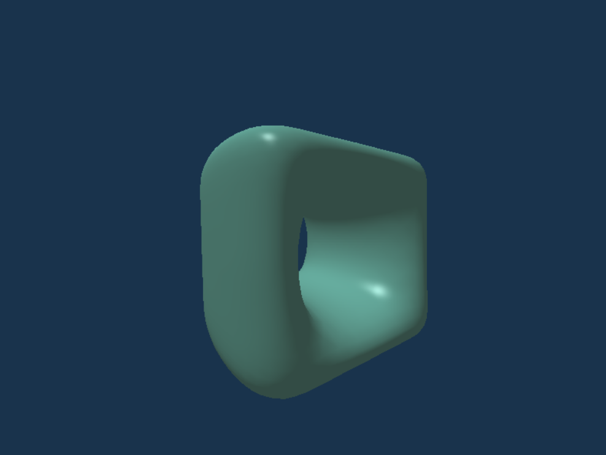

# Interesting Properties:


- Using Catmull-Clark Subdivision, converting the mesh back into triangles between each iteration of subdivision gives generates the same smooth surface as it would otherwise, however it is very jagged locally, creating a very interesting mesh.  The result looks like erosion from rivers


>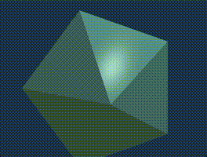  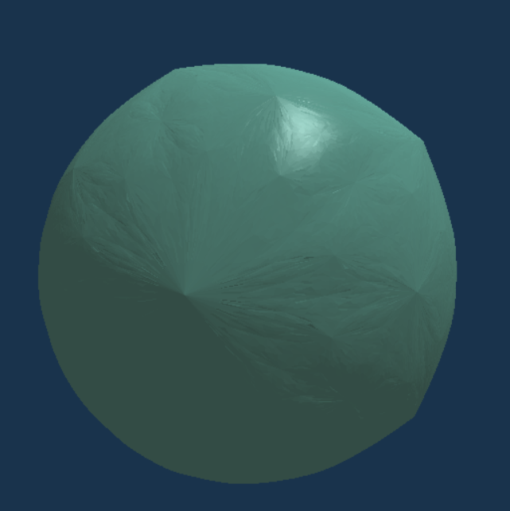

- Similar to above... alternating between using Catmull-Clark, and converting back to triangles and using Loop gives an similary interesting result, however rather than rivers we see resembles mountains and valleys

>  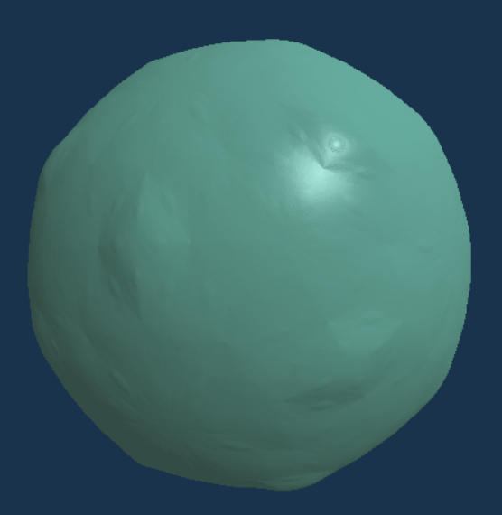

These artifacts arise from the converstion from quads to triangles and aren't necessarilly smooth but they interesting detail to the subdivided surfaces
